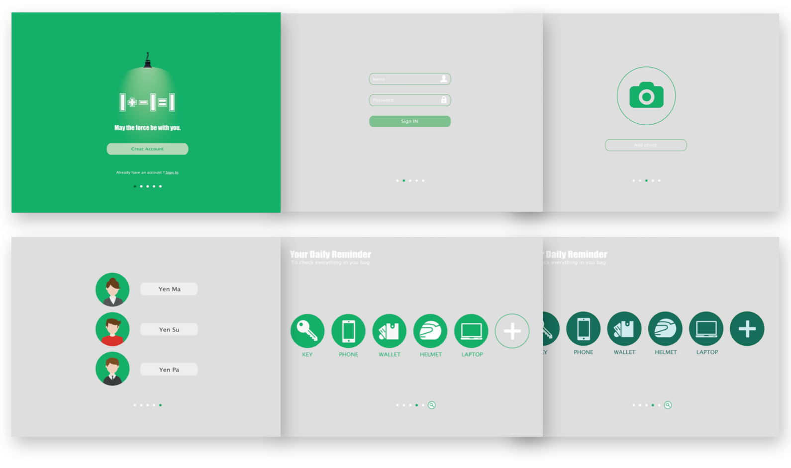

# 104 Final Project of Product Design and Innovation
### NTU．CSIE Course with NTUST．DT & NTU．EE
#### by Lin-Lin Chen (from NTUST．DT) & Yen-Kuang Chen from NTUEE

## Introduction

   「產品設計與創新」的期末報告。這是一門台科大設計學院前院長陳玲鈴老師與台大電機系陳彥光老師合開的課程。這學期的期末報告主要是做「物聯網」(Internet of Things)相關的應用，利用Intel的Edison board來實作物體與物體溝通的機制。

   我們這組提出的想法是要解決「出門時檢查是否忘記帶隨身物體」的問題，經過許多survey後實作了門上觸控面板check物體是否帶了、並將忘記攜帶的物體所在的房間燈打開，提醒使用者該物體在哪個房間內方便找尋。我們透過MQTT協定來溝通物體、信號強度來找尋在哪個房間內（這部分最後時間來不及先用藍芽實作）。

   這份程式碼主要是做平板check頁面之簡單prototype。一個簡單server與前台，並用MQTT協定傳輸與物體、智慧燈做溝通。

## User Interface

   

   *Design by Sabrina Yang